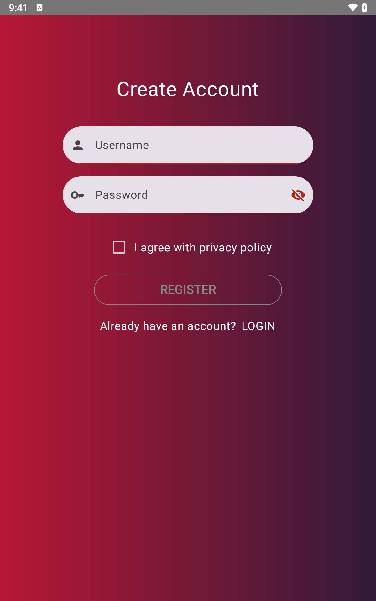
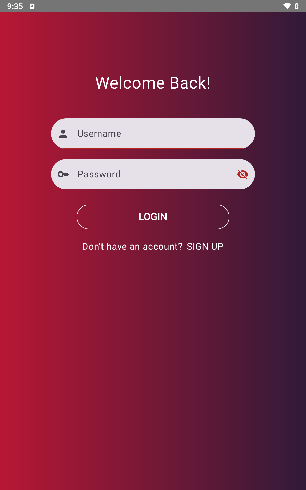
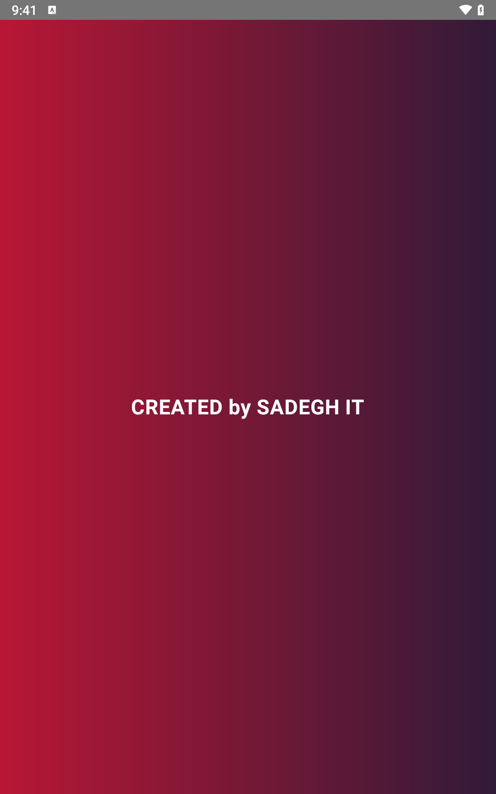
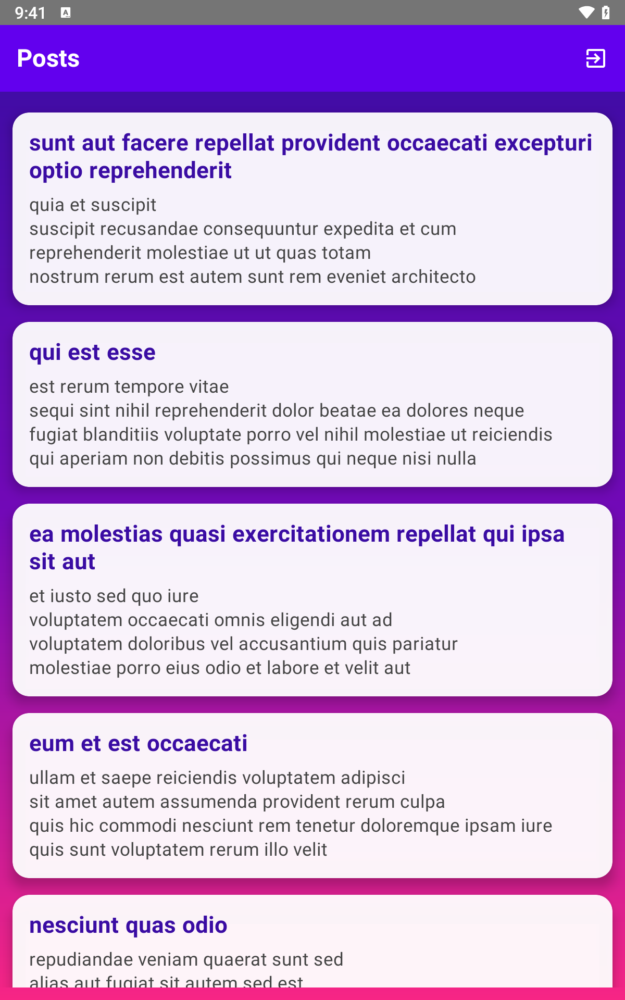

# LoginRegister

[](https://developer.android.com)
[](https://kotlinlang.org)
[](https://github.com/sadegh-it/LoginRegister?tab=MIT-1-ov-file)


##


 – یک اپلیکیشن اندروید با **Jetpack Compose، MVVM، Hilt و Retrofit** شامل:  
صفحه‌ی Splash Screen، ورود، ثبت‌نام و مشاهده پست‌ها از اینترنت.  

---

## ویژگی‌ها

- صفحه‌ی **Splash Screen** با انیمیشن حرفه‌ای  
- **ورود و ثبت‌نام کاربران**  
- نمایش **پست‌ها از اینترنت** با LazyColumn و طراحی مدرن  
- معماری **MVVM** و **Dependency Injection** با Hilt  
- استفاده از **Retrofit** و **Gson** برای شبکه  
- طراحی مدرن با **Material 3**

---
<table>
  <tr>
    <td>
      <p align="center">Register Screen</p>
      
    </td>
    <td>
      <p align="center">Login Screen</p>
      
    </td>
  </tr>
  <tr>
    <td>
      <p align="center">Splash Screen</p>
      
    </td>
    <td>
      <p align="center">Posts Screen</p>
      
    </td>
  </tr>
</table>


## نصب و اجرا

1. کلون کردن پروژه:
```bash
git clone https://github.com/sadegh-it/LoginRegister.git
